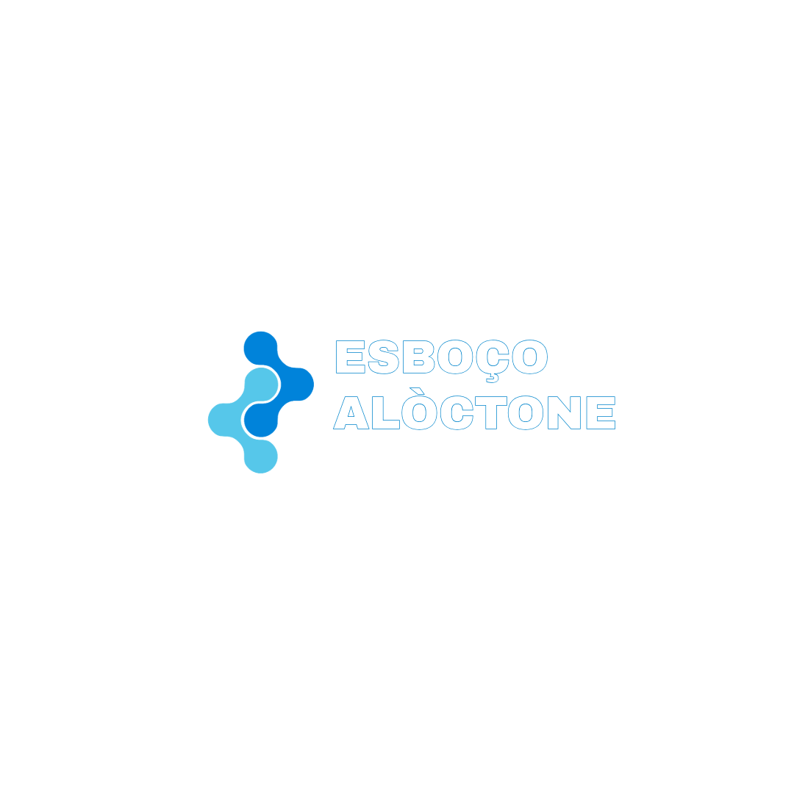

# 🌟 Esboço Alóctone - Plataforma de Integração para Migrantes

<div align="center">
  
  
  <p align="center">
    <strong>A primeira plataforma brasileira que conecta migrantes talentosos com empresas inclusivas</strong>
  </p>
  
  <p align="center">
    🌍 Conectando culturas • 💼 Criando oportunidades • 🚀 Construindo o futuro
  </p>
</div>

---

## 📋 Sobre o Projeto

**Esboço Alóctone** é uma plataforma digital inovadora que facilita a conexão entre duas necessidades reais do mercado brasileiro:

- **👥 Migrantes** que buscam oportunidades de trabalho e reconhecimento de suas habilidades
- **🏢 Empresas** que desejam contratar talentos qualificados e construir equipes diversas

### 🎯 Objetivos
- Facilitar a integração de migrantes no mercado de trabalho brasileiro
- Promover a diversidade e inclusão nas empresas
- Criar uma ponte entre culturas e oportunidades
- Contribuir para uma sociedade mais justa e equitativa

---

## 🛠️ Tecnologias Utilizadas

### **Backend**
- **Node.js** - Runtime JavaScript
- **Express.js** - Framework web minimalista
- **SQLite** - Base de dados local e simples
- **CORS** - Configuração de políticas de origem

### **Frontend**
- **React 19** - Biblioteca para interfaces de usuário
- **Vite** - Build tool moderna e rápida
- **React Router DOM** - Navegação entre páginas
- **Tailwind CSS** - Framework CSS utilitário

### **Características**
- ✅ **API RESTful** completa com operações CRUD
- ✅ **Interface moderna** e responsiva
- ✅ **Base de dados local** (sem configuração complexa)
- ✅ **Validações** de dados no frontend e backend
- ✅ **Design system** consistente

---

## 📁 Estrutura do Projeto

```
ProjetoFinal_grupo_08/
├── 📂 Backend/
│   ├── server.js              # Servidor Express com API REST
│   ├── empresa.db             # Base de dados SQLite
│   ├── package.json           # Dependências do backend
│   └── package-lock.json
├── 📂 Fronted/
│   ├── 📂 src/
│   │   ├── 📂 Pages/          # Páginas principais (6 páginas)
│   │   │   ├── HomePage.jsx           # Landing page moderna
│   │   │   ├── CadastroMigrantes.jsx  # Formulário de cadastro
│   │   │   ├── CadastroEmpresas.jsx   # Formulário de empresas
│   │   │   ├── MigrantesPage.jsx      # Lista de migrantes
│   │   │   ├── EmpresasPage.jsx       # Lista de empresas
│   │   │   ├── AllMigrantes.jsx       # Visualização completa
│   │   │   └── AllEmpresas.jsx        # Visualização completa
│   │   ├── 📂 Components/     # Componentes reutilizáveis (7 componentes)
│   │   │   ├── Header.jsx             # Cabeçalho unificado
│   │   │   ├── Footer.jsx             # Rodapé consistente
│   │   │   ├── FormMigrante.jsx       # Formulário de migrantes
│   │   │   ├── FormCompany.jsx        # Formulário de empresas
│   │   │   ├── ListOfMigrantes.jsx    # Lista componente
│   │   │   ├── ListOfCompanies.jsx    # Lista componente
│   │   │   ├── ModalEdit.jsx          # Modal para edição
│   │   │   └── ErrorBoundary.jsx      # Tratamento de erros
│   │   ├── 📂 assets/         # Recursos estáticos
│   │   │   └── logo.png               # Logotipo oficial
│   │   ├── 📂 Styles/         # Estilos customizados
│   │   │   └── app.css                # CSS adicional
│   │   ├── main.jsx                   # Ponto de entrada React
│   │   └── Routes.jsx                 # Configuração de rotas
│   ├── index.html                     # Template HTML
│   ├── package.json                   # Dependências do frontend
│   ├── vite.config.js                 # Configuração do Vite
│   ├── tailwind.config.js             # Configuração do Tailwind
│   └── postcss.config.js              # Configuração do PostCSS
└── README.md                          # Este arquivo
```

---

## 🚀 Como Executar o Projeto

### **Pré-requisitos**
- Node.js (versão 16 ou superior)
- npm ou yarn
- Git

### **1. Clonar o Repositório**
```bash
git clone https://github.com/AngelTJVzla/ProjetoFinal_grupo_08.git
cd ProjetoFinal_grupo_08
```

### **2. Configurar o Backend**
```bash
cd Backend
npm install
npm start
```
📡 **Servidor rodando em:** `http://localhost:3000`

### **3. Configurar o Frontend**
```bash
cd ../Fronted
npm install
npm run dev
```
🌐 **Aplicação rodando em:** `http://localhost:5173` (ou próxima porta disponível)

---

## 🔗 Endpoints da API

### **👥 Migrantes**
- `GET /migrantes` - Listar todos os migrantes
- `POST /migrantes` - Cadastrar novo migrante
- `GET /migrantes/:id` - Buscar migrante por ID
- `PUT /migrantes/:id` - Atualizar migrante completo
- `PATCH /migrantes/:id` - Atualizar migrante parcial
- `DELETE /migrantes/:id` - Remover migrante

### **🏢 Empresas**
- `GET /empresas` - Listar todas as empresas
- `POST /empresas` - Cadastrar nova empresa
- `GET /empresas/:id` - Buscar empresa por ID
- `PUT /empresas/:id` - Atualizar empresa completa
- `PATCH /empresas/:id` - Atualizar empresa parcial
- `DELETE /empresas/:id` - Remover empresa

### **📊 Utilitários**
- `GET /` - Informações da API
- `GET /limpiar-empresas-sin-cnpj` - Limpar empresas sem CNPJ

---

## 💡 Funcionalidades Principais

### **🌟 Para Migrantes**
1. **Cadastro Completo** - Formulário com validações robustas
2. **Perfil Profissional** - Registro de habilidades e experiências
3. **Busca de Oportunidades** - Conexão com empresas inclusivas
4. **Proteção de Dados** - Conformidade com LGPD

### **🏢 Para Empresas**
1. **Registro Empresarial** - Cadastro com CNPJ e setores
2. **Banco de Talentos** - Acesso a perfis qualificados
3. **Diversidade** - Construção de equipes multiculturais
4. **Responsabilidade Social** - Impacto social positivo

### **🎨 Interface**
- **Design Responsivo** - Funciona em todos os dispositivos
- **Navegação Intuitiva** - UX otimizada
- **Feedback Visual** - Animações e transições suaves
- **Acessibilidade** - Seguindo boas práticas

---

### 5. Acceder a la app
- Frontend: [http://localhost:5173](http://localhost:5173)
- Backend: [http://localhost:3000](http://localhost:3000)

## 📊 Dados de Exemplo

### **📝 Exemplo de Migrante (POST)**
```json
{
  "nombre": "MARÍA GONZÁLEZ",
  "pais": "VENEZUELA",
  "habilidades": "ENGENHARIA DE SOFTWARE",
  "email": "maria.gonzalez@email.com",
  "cpf": "12345678901"
}
```

### **🏢 Exemplo de Empresa (POST)**
```json
{
  "nombre": "TECH SOLUTIONS BRASIL LTDA",
  "sector": "TECNOLOGIA",
  "contacto": "rh@techsolutions.com.br",
  "ayuda": "Vagas para desenvolvedores e analistas",
  "cnpj": "12345678000199"
}
```

---

## 🔍 Testando com Postman

### **Importar Collection**
1. Abra o Postman
2. Importe as requisições básicas:
   - GET `http://localhost:3000/empresas`
   - POST `http://localhost:3000/migrantes`
   - PUT `http://localhost:3000/empresas/1`
   - DELETE `http://localhost:3000/migrantes/1`

### **Headers Necessários**
```
Content-Type: application/json
```

---

## 🎨 Paleta de Cores

- **Azul Principal:** `#78b3ff`, `#4480ff`, `#002eff`
- **Azul Escuro:** `#0031ff`, `#1a4fff`
- **Verde Destaque:** `#8ceb3e`
- **Emerald:** `#10b981`, `#059669`
- **Neutros:** Branco, cinza, preto

---

## 🌟 Características Especiais

### **✅ Validações Implementadas**
- **CPF:** Exatamente 11 números, sem repetição
- **CNPJ:** 14 números válidos
- **Email:** Formato válido obrigatório
- **Nome:** Mínimo nome e sobrenome
- **Campos obrigatórios:** Todas as validações no frontend e backend

### **🔒 Segurança e Privacidade**
- Conformidade com LGPD
- Validação de dados no servidor
- Sanitização de inputs
- Tratamento de erros robusto

### **📱 Responsividade**
- Design mobile-first
- Breakpoints otimizados
- Interface adaptável
- Experiência consistente

---

## 🚀 Deploy e Produção

### **Variáveis de Ambiente Recomendadas**
```env
# Backend
PORT=3000
DB_PATH=./empresa.db
NODE_ENV=production

# Frontend
VITE_API_URL=http://localhost:3000
```

### **Build para Produção**
```bash
# Frontend
cd Fronted
npm run build

# Backend (já está pronto)
cd Backend
npm start
```

---

## 📦 Dependências Principais

### **Backend**
```json
{
  "express": "^4.18.0",
  "cors": "^2.8.5",
  "sqlite3": "^5.1.0"
}
```

### **Frontend**
```json
{
  "react": "^19.1.0",
  "react-dom": "^19.1.0",
  "react-router-dom": "^7.6.2",
  "vite": "^6.3.5",
  "tailwindcss": "^4.1.10"
}
```

---

## 👥 Equipe de Desenvolvimento

**Grupo 08 - Turma 51**
- Desenvolvimento Full Stack
- Design UX/UI
- Implementação de APIs RESTful
- Integração Frontend/Backend

---

## 📈 Estatísticas do Projeto

- **17 arquivos .jsx** funcionais
- **API completa** com 12 endpoints
- **2 entidades** principais (Migrantes e Empresas)
- **6 páginas** principais navegáveis
- **7 componentes** reutilizáveis
- **100% responsivo** em todos os dispositivos

---

## 🛡️ Licença e Uso

Este projeto foi desenvolvido como **Projeto Final** para fins educacionais e demonstração de habilidades técnicas.

### **Tecnologias Open Source Utilizadas:**
- React (MIT License)
- Express.js (MIT License)
- Tailwind CSS (MIT License)
- SQLite (Public Domain)

---

## 📞 Contato e Suporte

Para dúvidas sobre o projeto:
- 📧 **Email:** contato@esboco-aloctone.com.br
- 📱 **Suporte:** +55 (11) 9999-9999
- 🌐 **Redes Sociais:** @esboco_aloctone

---

## 📝 Notas Importantes

- O arquivo `empresa.db` (base de dados SQLite) é criado automaticamente
- Não incluir `empresa.db` nem `node_modules` no repositório (já está no `.gitignore`)
- IDs são auto-incrementais e únicos permanentemente
- Projeto otimizado para desenvolvimento e produção

---

<div align="center">
  <p><strong>© 2025 Esboço Alóctone</strong></p>
  <p>Transformando vidas através da tecnologia e diversidade cultural 🇧🇷</p>
  
  ---
  
  <p><em>Desenvolvido com ❤️ pelo Grupo 08 - Turma 51</em></p>
</div>
